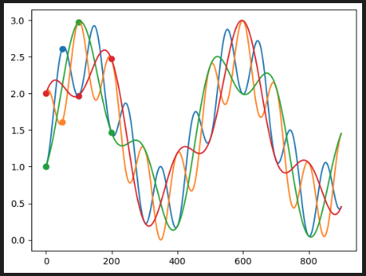

# Keyframed: Datatypes for working with keyframed parameters

This library provides interoperable datatypes for specifying and manipulating curves parameterized by keyframes and interpolators.



```python
# code thate generates the plot above
from keyframed import Composition, Curve, ParameterGroup, SmoothCurve
import math
import matplotlib.pyplot as plt

low, high = 0, 1
step1 = 50
step2 = 2 * step1
n = step1*18

fancy = Curve({0:0}, default_interpolation=lambda k,_: math.sin(2*k/(step1+step2)))
curves = ParameterGroup((
    SmoothCurve({0:low, (step1-1):high, (2*step1-1):low}, loop=True),
    SmoothCurve({0:high, (step1-1):low, (2*step1-1):high}, loop=True),

    SmoothCurve({0:low, (step2-1):high, (2*step2-1):low}, loop=True),
    SmoothCurve({0:high, (step2-1):low, (2*step2-1):high}, loop=True)))

fancy_curves = high + curves + fancy
fancy_curves.plot(n=n)

plt.show()
```


## Summary

The main purpose of this library is to implement the `Curve` class. "Keyframes" are special indices where the value of a `Curve` is defined. You can access data in a `Curve` pythonically using index syntax, as if it were a list. A `Curve` can be queried for values that aren't among its parameterizing keyframes: the result will be computed on the fly based on the interpolation method attached to the preceding keyframe and values on the surrounding keyframes. The default method of interpolation is "previous", which will simply return the value of the closest preceding keyframe (i.e. the default curve is a step function). Several other interpolation methods are provided, and custom interpolation is supported. Curves can also be modified via easing functions, which are essentially special interpolators. Curve objects also support basic arithmetic operations like addition and multiplication, producing `Composition`s of curves (which also support arithmetic). Compositions also support several reducing operators over arbitrarily many curves, e.g. average, min, max, etc.

The motivation for this library is to facilitate object-oriented parameterization of generative animations, specifically working towards a more expressive successor to the keyframing DSL developed by Chigozie Nri for parameterizing AI art animations (i.e. the keyframing syntax used by tools such as Disco Diffusion and Deforum).

## Installation


    pip install keyframed

## Curve Construction

To create a new `Curve` object, you can pass in any of the following arguments to the `Curve` constructor:

* An integer or float: this creates a `Curve` with a single keyframe at t=0 with the given value.
* A dictionary: this creates a `Curve` with keyframes at the keys of the dictionary with the corresponding values, which can either be numeric values or `Keyframe` objects.
* A list/tuple of lists/tuples: this creates a `Curve` with keyframes at the keys in the tuple with the corresponding values. The tuple should be in the format `((k0,v0), (k1,v1), ...)`.

```python
from keyframed import Curve

# create a curve with a single keyframe at t=0 with value 0
curve1 = Curve()

# create a curve with a single keyframe at t=0 with value 10
curve2 = Curve(10)

# create a curve with keyframes at t=0 and t=2 with values 0 and 2, respectively
curve3 = Curve({0:0, 2:2})

# create a curve with keyframes at t=0 and t=2 with values 0 and 2, respectively
curve4 = Curve([(0,0), (2,2)])
```

By default `Curve` objects behave as step functions. This can be modified by specifying different interpolation methods, which will be discussed at length further below. A versatile alternative default is provided via the `SmoothCurve` class, which simply has a different setting for `default_interpolation` (see more on interpolation methods and API below). 

To visualize a curve, just call its `.plot()` method. Curves carry a `label` attribute: if this is populated, it will be used to label the curve in the plot.


```python
from keyframed import Curve, SmoothCurve
import matplotlib.pyplot as plt

kfs = {0:0,1:1,10:10}
c = Curve(kfs, label='stepfunc')
sc = SmoothCurve(kfs, label='smoothfunc')

c.plot()
sc.plot(linestyle='dashed')

plt.legend()
plt.show()
```


## Curve Properties

- keyframes: returns a list of the keyframes in the curve.
- values: returns a list of the values at the keyframes in the curve.
- label: if not specified when initialized, a label will be auto-generated. labels can be modified any time by changing the `.label` attribute directly

```python
curve = Curve({0:0,2:2})

print(curve.keyframes)  # prints [0, 2]
print(curve.values)  # prints [0, 2]
print(curve.label)  # prints something like "curve_SiF86D
```

## Curve Indexing

You can access the value of a keyframe in the curve by indexing the curve object with the key. If the key is not in the curve, the curve will use interpolation (defaults to 'previous') to return a value.

```python
from keyframed import Curve

curve = Curve({0:0,2:2})

print(curve[0])  # prints 0
print(curve[1])  # prints 0
print(curve[2])  # prints 2
```


## Curve Assignment

You can set the value of a keyframe in the curve by assigning to the curve object with the key. If the key is not in the curve, a new `Keyframe` will be created (see bottom for details).

```python
from keyframed import Curve

curve = Curve() # equivalent to Curve({0:0})

curve[0] = 10
curve[1] = 20
curve[2] = 30

print(curve)  # prints "Curve({0: 10, 1: 20, 2: 30})"
```


## Curve Arithmetic

All classes inheriting from `CurveBase` (`Curve`, `ParameterGroup`, `Composition`) support basic arithmetic with numeric values and with other `CurveBase` childclasses.


```python
from keyframed import Curve

curve = Curve({0:0, 2:2})

curve1 = curve + 1
print(curve1[0]) # 1
print(curve1[1]) # 1
print(curve1[2]) # 3

curve2 = curve * 2
print(curve1[0]) # 0
print(curve1[1]) # 0
print(curve1[2]) # 4

curve3 = curve + Curve((1,1))
print(curve3[0]) # 0
print(curve3[1]) # 1
print(curve3[2]) # 3
```

## Interpolation

<!-- 

to do: add plots demonstrating what each interpolator and easing function looks like

-->

The Curve class defaults to "previous" interpolation, which returns the value of the keyframe to the left of the given key if the given key is not already assigned a value. Additionally, all interpolation methods of `scipy.interpolate.interp1d` are also supported (‘linear’, ‘nearest’, ‘nearest-up’, ‘zero’, ‘slinear’, ‘quadratic’, ‘cubic’, ‘next’).

```python
from keyframed import Curve

curve = Curve({0:0, 2:2})

print(curve[0]) # 0
print(curve[1]) # 0
print(curve[2]) # 2

# yes, setting t in the Keyframe object is redundant. working on it.
curve[0] = Keyframe(t=0, value=0, interpolation_method='linear')

print(curve[0]) # 0
print(curve[1]) # 1
print(curve[2]) # 2
```

You can also define custom interpolation methods. The call signature should take the a frame index as the first argument (`k`) and the Curve object itself (`curve`) as the second. You can then specify the custom method inside a `Keyframe`, assign the callable to the key directly, or register it as a named interpolation method,

```python
from keyframed import Curve, Keyframe, register_interpolation_method

def my_linear(k, curve):
    # get the leftmost and rightmost keyframe objects
    left = bisect_left_keyframe(k, curve)
    right = bisect_right_keyframe(k, curve)
    # extract x and y values from keyframe objects
    x0, x1 = left.t, right.t
    y0, y1 = left.value, right.value
    # calculate interpolation
    d = x1-x0
    t = (x1-k)/d
    outv =  t*y0 + (1-t)*y1
    return outv

curve = Curve({0:0, 2:2})
print(curve[0]) # 0
print(curve[1]) # 0
print(curve[2]) # 2

curve[0] = Keyframe(t=0, value=0, interpolation_method=my_linear)

print(curve[0]) # 0
print(curve[1]) # 1
print(curve[2]) # 2

# shorthand: assign the callable directly
curve = Curve({0:0, 2:2})
curve[0] = my_linear

print(curve[0]) # 0
print(curve[1]) # 1
print(curve[2]) # 2

# register the function to a name
register_interpolation_method('my_interpolator', my_linear)

curve = Curve({0:0, 2:2})
curve[0] =  Keyframe(t=0, value=0, interpolation_method='my_interpolator)

print(curve[0]) # 0
print(curve[1]) # 1
print(curve[2]) # 2
```

## Looping

The Curve class has a `loop` attribute that can be set to `True` to make the curve loop indefinitely.

```python
curve = Curve({0:0, 1:1}, loop=True)

print(curve[0])  # prints 0
print(curve[1])  # prints 1
print(curve[2])  # prints 0
print(curve[3])  # prints 1

curve.plot(n=5)
```


## Using the `ParameterGroup` class

The `ParameterGroup` class provides a convenient way to manipulate parameters together. To use it, you will first need to create a dictionary of parameters, where the keys are the names of the parameters and the values are `Curve` objects. You can then pass this dictionary to the ParameterGroup constructor, along with an optional weight parameter which can be a Curve or a Number. If not provided, the weight defaults to `Curve(value=1)`. The names provided in this dict will be used for the `label` attribute of the associated curves, overriding the curves label if one was already assigned.

```python
from keyframed import Curve, ParameterGroup

# create a dictionary of parameters
parameters = {
    "volume": Curve(0.5),
    "pitch": Curve(1.0),
    "rate": Curve(1.0),
}

# create a parameter group with a weight of 1.0
parameter_group = ParameterGroup(parameters, weight=1.0)

# access the current parameter values at key 0
print(parameter_group[0])  # {"volume": 0.5, "pitch": 1.0, "rate": 1.0}

# modify the weight parameter
parameter_group.weight *= 2.0

# access the current parameter values at key 0 again
print(parameter_group[0])  # {"volume": 1.0, "pitch": 2.0, "rate": 2.0}
```

ParameterGroups can also be used to visualize curves together. The `ParameterGroup.plot()` method
will use the duration of the longest curve in the group as the domain for the plot.

```python
from keyframed import Curve, SmoothCurve, ParameterGroup
import matplotlib.pyplot as plt

kfs = {0:0,1:1,10:10}
pg = ParameterGroup({
    'stepfunc':Curve(kfs),
    'smoothfunc':SmoothCurve(kfs),
    'longstep':Curve({15:15}),
})


pg.plot()
plt.legend()
plt.show()
```


<!-- 

to do: customizxed compositions

-->

<!-- 

to do: some pretty example with fancy math

-->


# Peeking under the hood 

The following sections provide implementation details for advanced users

## How `Curves` work

`Curve` objects are built on top of a `sortedcontainer.SortedDict` that lives on the `Curve._data` attribute (which you generally should not access directly). When you assign values to time indices on the curve, a key is written into `_data` and associated with a `Keyframe` object, which is basically just a named tuple that carries the attributes `t`, `value`, and `interpolation_method`. If the user queries a `Curve` for an index that is already assigned to `_data`, the corresponding `Keyframe.value` is returned directly. Otherwise, the `Keyframe` object associated with the leftmost populated index in `_data` is used to infer the appropriate interpolation method to use.