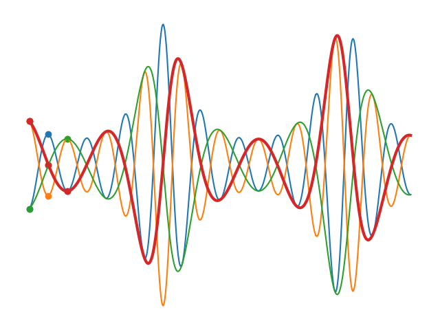

# <p align=center> Keyframed

<!--

-->

 <p align=center>

## <p align=center>Simple, Expressive Datatypes <br>For Manipulating Parameter Curves

This library implements a suite of pythonic datatypes for specifying and manipulating curves parameterized by keyframes and interpolators.

```python
# generates the image above
!pip install keyframed
from keyframed import Composition, Curve, ParameterGroup, SmoothCurve
import math
import matplotlib.pyplot as plt

n = 1000
low, high = 0.0001, 0.3
step1 = 50
step2 = 2 * step1

# Define some curves, related through shared parameters.
# Each curve loops through three keyframes, smoothly interpolating between each.
curves = ParameterGroup((
    SmoothCurve({0:low,  (step1-1):high, (2*step1-1):low},  loop=True),
    SmoothCurve({0:high, (step1-1):low,  (2*step1-1):high}, loop=True),
    SmoothCurve({0:low,  (step2-1):high, (2*step2-1):low},  loop=True),
    SmoothCurve({0:high, (step2-1):low,  (2*step2-1):high}, loop=True)))

# Define another curve implicitly, extrapolating from a function
fancy = Curve.from_function(lambda k: high + math.sin(2*k/(step1+step2)))

# arithmetic on curves
curves_plus_fancy = curves + fancy + 1
curves_summed_by_frame = Composition(curves_plus_fancy, reduction='sum')
really_fancy = curves_plus_fancy / curves_summed_by_frame

# isolate a single channel
channel_name = list(really_fancy[0].keys())[-1]
red_channel = Curve.from_function(lambda k: really_fancy[k][channel_name])

# built-in plotting
really_fancy.plot(n=n)
red_channel.plot(n=n, linewidth=3, linestyle='-', color='#d62728')

plt.gca().axis('off')
plt.tight_layout()
plt.savefig('static/images/fancy.png')
plt.show()
```


## Summary

The motivation for this library is to facilitate object-oriented parameterization of generative animations, specifically working towards a more expressive successor to the keyframing DSL developed by [Chigozie Nri](https://www.chigozie.co.uk/) for parameterizing AI art animations (i.e. the keyframing syntax used by tools such as Disco Diffusion and Deforum).

The main purpose of this library is to implement the `Curve` class. "Keyframes" are special indices where the value of a `Curve` is defined. You can access data in a `Curve` using container indexing syntax, as if it were a list or dict. A `Curve` can be queried for values that aren't among its parameterizing keyframes: the result will be computed on the fly based on the interpolation method attached to the preceding keyframe and values on the surrounding keyframes.

The default method of interpolation is "previous", which will simply return the value of the closest preceding keyframe (i.e. the default curve is a step function). Several other interpolation methods are provided, and interpolation/extrapolation with user-defined functions is supported. Curves can also be modified via easing functions, which are essentially special interpolators.

Curve objects also support basic arithmetic operations like addition and multiplication, producing `Composition`s of curves (which also support arithmetic). Compositions also support several reducing operators over arbitrarily many curves, e.g. average, min, max, etc.


## Installation

    pip install keyframed

## Curve Construction

To create a new `Curve` object, you can pass in any of the following arguments to the `Curve` constructor:

* An integer or float: this creates a `Curve` with a single keyframe at t=0 with the given value.
* A dictionary: this creates a `Curve` with keyframes at the keys of the dictionary with the corresponding values, which can either be numeric values or `Keyframe` objects.
* A list/tuple of lists/tuples: this creates a `Curve` with keyframes at the keys in the tuple with the corresponding values. The tuple should be in the format `((k0,v0), (k1,v1), ...)`.

```python
from keyframed import Curve

# create a curve with a single keyframe at t=0 with value 0
curve1 = Curve()

# create a curve with a single keyframe at t=0 with value 10
curve2 = Curve(10)

# create a curve with keyframes at t=0 and t=2 with values 0 and 2, respectively
curve3 = Curve({0:0, 2:2})

# create a curve with keyframes at t=0 and t=2 with values 0 and 2, respectively
curve4 = Curve([(0,0), (2,2)])
```

To facilitate compatibility with existing generative art tooling for AI animation, curve objects can also
be initialized from the "Chigozie Nri string format" used by tools like Disco Diffusion and Deforum.

```python
from keyframed.dsl import curve_from_cn_string
curve5 = curve_from_cn_string("1:(1), 10:(10)")

# Adding an arbitrary label for equivalence evaluation
curve5.label = "foobar"
assert curve5 == Curve({0:1, 1:1, 10:10}, default_interpolation='linear', label="foobar")
```


By default `Curve` objects behave as step functions. This can be modified by specifying different interpolation methods, which will be discussed at length further below. A versatile alternative default is provided via the `SmoothCurve` class, which simply has a different setting for `default_interpolation` (see more on interpolation methods and API below). 

To visualize a curve, just call its `.plot()` method. Curves carry a `label` attribute: if this is populated, it will be used to label the curve in the plot.


```python
from keyframed import Curve, SmoothCurve
import matplotlib.pyplot as plt

kfs = {0:0,1:1,10:10}
c = Curve(kfs, label='stepfunc')
sc = SmoothCurve(kfs, label='smoothfunc')

c.plot()
sc.plot(linestyle='dashed')

plt.legend()
plt.show()
```


## Curve Properties

- keyframes: returns a list of the keyframes in the curve.
- values: returns a list of the values at the corresponding keyframes.
- label: if not specified when initialized, a label will be auto-generated. labels can be modified any time by changing the `.label` attribute directly

```python
curve = Curve({0:0,2:2})

print(curve.keyframes)  # prints [0, 2]
print(curve.values)  # prints [0, 2]
print(curve.label)  # prints something like "curve_SiF86D
```

## Curve Indexing

You can access the value of a keyframe in the curve by indexing the curve object with the key. If the key is not in the curve, the curve will use interpolation (defaults to 'previous') to return a value.

```python
from keyframed import Curve

curve = Curve({0:0,2:2})

print(curve[0])  # prints 0
print(curve[1])  # prints 0
print(curve[2])  # prints 2
```


### Curve Slicing

Curves also support slice indexing. The result of a slice will be re-indexed such that the beginning of the slice corresponds to the 0th keyframe index (t=0). NB: The terminal index of the slice is *inclusive*, which is a little unpythonic but makes sense when considering that these are actually time indices rather than discrete container indices.

```python
curve = Curve({i:i for i in range(10)})
print(curve[0], curve[3] curve[5]) # 0, 3, 5

sliced = curve[3:5]
print(sliced[0], sliced[2], sliced[5]) # 3, 5, 5
```


## Curve Assignment

You can set the value of a keyframe in the curve by assigning to the curve object with the key. If the key is not in the curve, a new `Keyframe` will be created (see bottom for details).

```python
from keyframed import Curve

curve = Curve() # equivalent to Curve({0:0})

curve[0] = 10
curve[1] = 20
curve[2] = 30

print(curve)  # prints "Curve({0: 10, 1: 20, 2: 30})"
```


## Curve Arithmetic

All classes inheriting from `CurveBase` (`Curve`, `ParameterGroup`, `Composition`) support basic arithmetic with numeric values and with other `CurveBase` childclasses.


```python
from keyframed import Curve

curve = Curve({0:0, 2:2})

curve1 = curve + 1
print(curve1[0]) # 1
print(curve1[1]) # 1
print(curve1[2]) # 3

curve2 = curve * 2
print(curve1[0]) # 0
print(curve1[1]) # 0
print(curve1[2]) # 4

curve3 = curve + Curve((1,1))
print(curve3[0]) # 0
print(curve3[1]) # 1
print(curve3[2]) # 3
```

## Interpolation

<!-- 

to do: add plots demonstrating what each interpolator and easing function looks like

-->

The Curve class defaults to "previous" interpolation, which returns the value of the keyframe to the left of the given key if the given key is not already assigned a value. Other provided interpolation methods include "linear", "next" and "eased_lerp" (the default interpolator for `SmoothCurve`).

```python
from keyframed import Curve

curve = Curve({0:0, 2:2})

print(curve[0]) # 0
print(curve[1]) # 0
print(curve[2]) # 2

# yes, setting t in the Keyframe object is redundant. working on it.
curve[0] = Keyframe(t=0, value=0, interpolation_method='linear')

print(curve[0]) # 0
print(curve[1]) # 1
print(curve[2]) # 2
```

### Custom interpolation with user-defined functions

You can also define custom interpolation methods. The call signature should take the a frame index as the first argument (`k`) and the Curve object itself (`curve`) as the second. You can then specify the custom method inside a `Keyframe`, assign the callable to the key directly, or register it as a named interpolation method,

```python
from keyframed import (
    bisect_left_keyframe,
    bisect_right_keyframe,
    Curve,
    Keyframe,
    register_interpolation_method,
)

def my_linear(k, curve):
    # get the leftmost and rightmost keyframe objects
    left = bisect_left_keyframe(k, curve)
    right = bisect_right_keyframe(k, curve)

    # Get the coordinates between which we'll be interpolating
    x0, x1 = left.t, right.t
    y0, y1 = left.value, right.value

    # Convert the input keyframe index to a "progress" value -- `t` -- in [0,1]
    d = x1-x0
    t = (x1-k)/d

    # Calculate the interpolation
    # (this fomula is called "lerp", short for Linear intERPolation)
    outv =  t*y0 + (1-t)*y1
    return outv

curve = Curve({0:0, 2:2})

print(curve[0]) # 0
print(curve[1]) # 0
print(curve[2]) # 2
curve.plot(label='stepfunc')

# the interpolation method at frame 0 is still 'previous'.
curve[1] = Keyframe(t=1, value=1, interpolation_method=my_linear)

print(curve[0]) # 0
print(curve[1]) # 1
print(curve[2]) # 2
curve.plot(label='my_linear interpolated', linestyle='dashed')

plt.legend()
```


Alternatively, you can accomplish the same thing by assigning the callable to the keyframe index directly. 

```python
# shorthand: assign the callable directly
curve = Curve({0:0, 2:2})
curve[0] = my_linear

print(curve[0]) # 0
print(curve[1]) # 1
print(curve[2]) # 2
```

Both of the above methods will work, however: you'll need to use something like `pickle` for serialization. To facilitate safer serialization, you can "register" your custom interpolation method into the library's registry of available interpolation methods and then reference it by name as a string.


```python
# register the function to a named interpolator
register_interpolation_method('my_interpolator', my_linear)

# invoke interpolator by name
curve = Curve({0:0, 2:2})
curve[0] =  Keyframe(t=0, value=0, interpolation_method='my_interpolator)

print(curve[0]) # 0
print(curve[1]) # 1
print(curve[2]) # 2
```


### Interpolation with extended context windows

```python
from keyframed.interpolation import get_context_left, get_context_right

import numpy as np
from scipy.interpolate import interp1d
import random
random.seed(123) # just for reproducibility

def user_defined_quadratic_interp(k, curve, n=2):
  xs = get_context_left(k, curve, n)
  xs += get_context_right(k, curve, n)
  ys = [curve[x] for x in xs]
  f = interp1d(xs, ys, kind='quadratic')
  return f(k)

# sample some random points that are linearly correlated with some jitter
d = {i:i+2*random.random() for i in range(10)}
curve = Curve(d, default_interpolation=user_defined_quadratic_interp)

xs = np.linspace(0,9,100)
curve.plot(xs=xs)
```


<!--

to do: using custom interpolators for f(k) "extrapolation" (i.e. the fibonacci demo)

-->

## Looping

The Curve class has a `loop` attribute that can be set to `True` to make the curve loop indefinitely.

```python
curve = Curve({0:0, 1:1}, loop=True)

print(curve[0])  # prints 0
print(curve[1])  # prints 1
print(curve[2])  # prints 0
print(curve[3])  # prints 1

curve.plot(n=5)
```


## Using the `ParameterGroup` class

The `ParameterGroup` class provides a convenient way to manipulate parameters together. To use it, you will first need to create a dictionary of parameters, where the keys are the names of the parameters and the values are `Curve` objects. You can then pass this dictionary to the ParameterGroup constructor, along with an optional weight parameter which can be a Curve or a Number. If not provided, the weight defaults to `Curve(1)` (constant value of 1). The names provided in this dict will be used for the `label` attribute of the associated curves, overriding each curve's label if one was already assigned.

```python
from keyframed import Curve, ParameterGroup

# create a dictionary of parameters
parameters = {
    "volume": Curve(0.5),
    "pitch": Curve(1.0),
    "rate": Curve(1.0),
}

# create a parameter group with a weight of 1.0
parameter_group = ParameterGroup(parameters, weight=1.0)

# access the current parameter values at key 0
print(parameter_group[0])  # {"volume": 0.5, "pitch": 1.0, "rate": 1.0}

# modify the weight parameter
parameter_group.weight *= 2.0

# access the current parameter values at key 0 again
print(parameter_group[0])  # {"volume": 1.0, "pitch": 2.0, "rate": 2.0}
```

The return value from indexing into a `ParameterGroup` is a modified `dict` that similarly propogates arithmetic operations to its values.

```python
# access the current parameter values at key 0 again
returned_value = parameter_group[0]
print(returned_value)  # {"volume": 1.0, "pitch": 2.0, "rate": 2.0}

modified = returned_value * 2
print(modified) # {"volume": 2.0, "pitch": 4.0, "rate": 4.0}
```


ParameterGroups can also be used to visualize curves together. The `ParameterGroup.plot()` method
will use the duration of the longest curve in the group as the domain for the plot.

```python
from keyframed import Curve, SmoothCurve, ParameterGroup
import matplotlib.pyplot as plt

kfs = {0:0,1:1,10:10}
pg = ParameterGroup({
    'stepfunc':Curve(kfs),
    'smoothfunc':SmoothCurve(kfs),
    'longstep':Curve({15:15}),
})


pg.plot()
plt.legend()
plt.show()
```


<!--

to do: basics of compositions

-->


<!--

to do: compositional parametergroups

-->


<!-- 

to do: customized compositions

-->


## Serialization


All classes that inherit from `CurveBase` can be serialized to and from yaml
via `keyframed.serialization.to_yaml` and `keyframed.serialization.from_yaml`.

Default `to_yaml` serialization generates a "simplified" output by default, which
should be reasonably intuitive to manipulate in yaml form. For a more verbose, explicit
yaml output, just set `simplify=False`.

```python
# just play with to_yaml, you'll get the idea
from keyframed import SmoothCurve, ParameterGroup, serialization

low, high = 0.0001, 0.3
step1 = 50
curves = ParameterGroup({
    'foo':SmoothCurve({0:low, (step1-1):high, (2*step1-1):low}, loop=True),
    'bar':SmoothCurve({0:high, (step1-1):low, (2*step1-1):high}, loop=True)
})

txt = serialization.to_yaml(curves, simplify=True)

assert txt == """
parameters:
  foo:
    curve:
    - - 0
      - 0.0001
      - eased_lerp
    - - 49
      - 0.3
    - - 99
      - 0.0001
    loop: true
  bar:
    curve:
    - - 0
      - 0.3
      - eased_lerp
    - - 49
      - 0.0001
    - - 99
      - 0.3
    loop: true
""".strip()

curves = serialization.from_yaml(txt)
```

For most users, yaml serialization will probably be more useful. The yaml serialization machinery is built around an intermediary `dict` structure 
that might be more appropriate for certain use cases, such as users who want to serialize keyframed objects to JSON.

```python
d = curves.to_dict(simplify=True, for_yaml=False)
## returned dict looks like this:
# {'parameters': {'foo': {'curve': {0: {'value': 0.0001,
#      'interpolation_method': 'eased_lerp'},
#     49: {'value': 0.3},
#     99: {'value': 0.0001}},
#    'loop': True},
#   'bar': {'curve': {0: {'value': 0.3, 'interpolation_method': 'eased_lerp'},
#     49: {'value': 0.0001},
#     99: {'value': 0.3}},
#    'loop': True}}}

curves = serialization.from_dict(d)
```
 
 If you're using customization features like user-defined interpolators, use the "interpolator registration" functionality
 for compatibility with these serialization tools. The "registration" step will need to be repeated in the deserialization
 environment to ensure the named interpolator is available when evaluating the deserialized curve objects.


# Advanced: Peeking under the hood 

The following sections provide implementation details for advanced users

## How `Curves` work

`Curve` objects are built on top of a `sortedcontainer.SortedDict` that lives on the `Curve._data` attribute (which you generally should not access directly). When you assign values to time indices on the curve, a key is written into `_data` and associated with a `Keyframe` object, which is basically just a named tuple that carries the attributes `t`, `value`, and `interpolation_method`. If the user queries a `Curve` for an index that is already assigned to `_data`, the corresponding `Keyframe.value` is returned directly. Otherwise, the `Keyframe` object associated with the leftmost populated index in `_data` is used to infer the appropriate interpolation method to use.


## How arithmetic operations on `Curves` works

The return value of airthmetic on a `CurveBase` child class is a `Composition` object, which is a special kind of `ParameterGroup` that also has a `reduction` attribute. The `Composition` encapsulates the computation of the arithmetic. When a user queries the value for a key, the normal return value from querying a `ParameterGroup` is passed to `functools.reduce`, which applies the appropriate `operator` function based on the named `Composition.reduction`. The result of this reduction operation is then returned. 

Although they inherit from the `ParameterGroup` class, `Composition` objects should generally be treated more like `Curve` objects. That being said, arithmetic on a `ParameterGroup` also returns a `Composition` object (which you may see referred to as a "compositional parameter group"), but one which will behave more like a `ParameterGroup` object. Normally, the `ParameterGroup.parameters` attribute can be used to isolate "channels" from the `ParameterGroup`, but at this time `Composition.parameters` can't be used this way: this attribute carries the operands of the arithmetic operation instead. Forthcoming changes will facilitate isolating/extracting/compiling specific"parameter channel" `Curve` objects from compositional pgroups.
